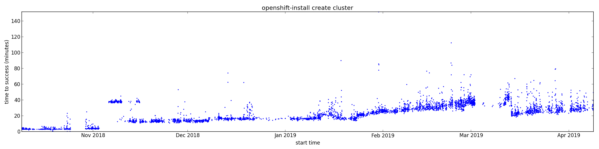

Cluster creation time, by pattern matching in build logs for the [the origin release-promotion jobs][origin-release].
Run:

```console
$ create-cluster.py
```

to produce both PNG and SVG output with the duration of the `setup` container:



Viewing the SVG output in your browser allows you to use the markers as hyperlinks to the job's build page.

[origin-release]: https://origin-release.svc.ci.openshift.org/
