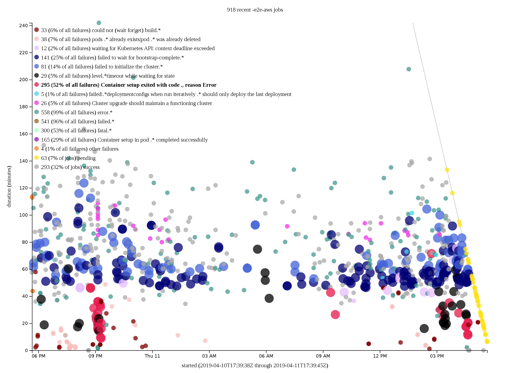

In one terminal, periodically sync the data:

```console
$ while sleep 60; do curl -s https://prow.svc.ci.openshift.org/data.js >data.js && ../deck-build-log/deck-build-log-pull; done
```

In another, run the local server:

```console
$ ./server
```

Then visit http://localhost:8000.
This will render the chart, wait 60 seconds after rendering, and refetch and re-render.
We will continue to refresh every minute while you have the page open.



Click the chart title to edit the job-name filter string (`-e2e-aws` by default).
Currently you have to edit [`index.html`](index.html) to adjust the build-log regular expressions.

Hover over data points to get a tooltip with all of the error lines matching any regular expression (although point-color is from the earliest matching regular expression).
Hover over the regular expression in the legend to double the size of the matching data points (regardless of whether that match is the earliest matching regular expression).

Press `s` to copy the SVG to your clipboard, after which you can save with:

```console
$ xsel -b >deck.svg
```

or similar, depending on your window manager.  You can use [ImageMagick][] to convert to other formats, such as PNG:

```console
$ convert -density 160 deck.svg deck.png
```

[ImageMagick]: https://www.imagemagick.org/
