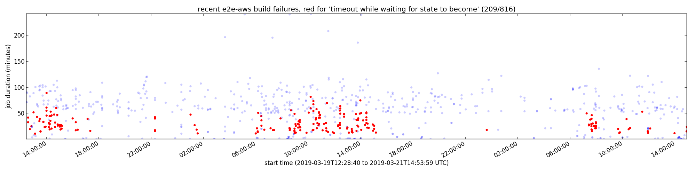

Scripts for pulling and grepping Deck builds logs.
This makes it easier to estimate the impact of a given error in OpenShift CI.
First, populate your local cache of build logs from recent failing `*-e2e-aws` jobs:

```console
$ deck-build-log-pull
  % Total    % Received % Xferd  Average Speed   Time    Time     Time  Current
                                 Dload  Upload   Total   Spent    Left  Speed
100 7250k    0 7250k    0     0  2612k      0 --:--:--  0:00:02 --:--:-- 2611k
  % Total    % Received % Xferd  Average Speed   Time    Time     Time  Current
                                 Dload  Upload   Total   Spent    Left  Speed
100  2014  100  2014    0     0   4129      0 --:--:-- --:--:-- --:--:--  4135
...
```

This seems to pull 48 hours of failures by default, so the first run will take a while.
Subsequent `deck-build-log-pull` calls will fetch the list of recent jobs, but will then only download build logs from new failures, so they'll be faster if you're polling throughout the day.

I still need to set something up to expire stale cache entries.
For now, just blow away `~/.cache/openshift-deck-build-logs` each morning (and eat the cost of re-pulling the overlapping 24 hours).

Then search the logs for a given error message:

```console
$ deck-build-log-grep 'timeout while waiting for state to become'
timeout while waiting for state to become matches 209 of 816 failures
.../.cache/openshift-deck-build-logs/pr-logs/pull/22363/pull-ci-openshift-origin-master-e2e-aws/5750/build-log.txt:2
.../.cache/openshift-deck-build-logs/pr-logs/pull/22363/pull-ci-openshift-origin-master-e2e-aws/5774/build-log.txt:4
...
```

To plot matching failures over time, you can use:

```console
$ deck-build-log-plot 'timeout while waiting for state to become'
```

which produces both PNG and SVG output like:



Viewing the SVG output in your browser allows you to use the markers as hyperlinks to the job's build page. 

There are `FIXME` markers in `deck-build-log-plot` in case you want to alter it to perform a different analysis.
