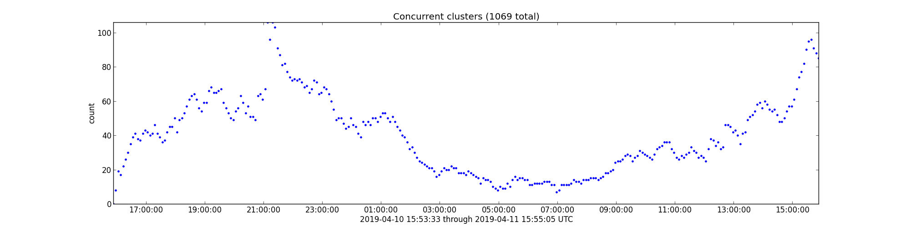
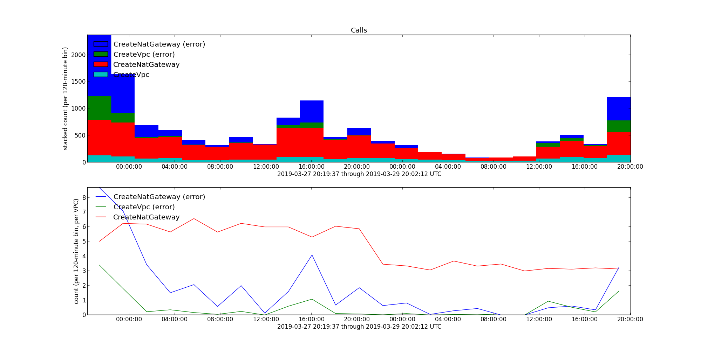

Plot VPC throughput over time.
This can be useful for understanding the load on the account when diagnosing AWS-API throttling errors.
Crunch the CSV output from:

```sql
SELECT eventtime,
       eventname,
       useridentity.username,
       useragent,
       errorcode,
       errormessage
FROM "default"."cloudtrail_logs_cloud_trail_test_clayton"
WHERE from_iso8601_timestamp(eventtime) > date_add('hour', -48, now())
  AND eventname IN ('CreateVpc', 'DeleteVpc')
ORDER BY eventtime;
```

with:


```console
$ vpc.py <vpc.csv
1242  CreateVpc
1205  DeleteVpc
7     Client.VpcLimitExceeded
1112  Client.DependencyViolation
1791  Client.RequestLimitExceeded
```

to generate plots like:


You can also scrape Prow/Deck's data to plot concurrent clusters over time (for the past ~48 hours or so, depending on how much data Deck is holding).
Run:

```console
$ concurrent.py
```

to generate plots like:



You can also feed similar data into `calls-per-vpc.py` to see how often a call is being made per `CreateVpc` call.
After adjusting the above Athena query to use:

```sql
eventname IN ('CreateVpc', 'CreateNatGateway')
```

(or whatever calls you are interested in, as long as you include `CreateVpc`), run:

```console
$ calls-per-vpc.py <vpc-and-nat.csv
13685  9.01   CreateNatGateway (error)
9886   6.51   CreateVpc (error)
8664   5.70   CreateNatGateway
1519   1.00   CreateVpc
```

to generate plots like:


