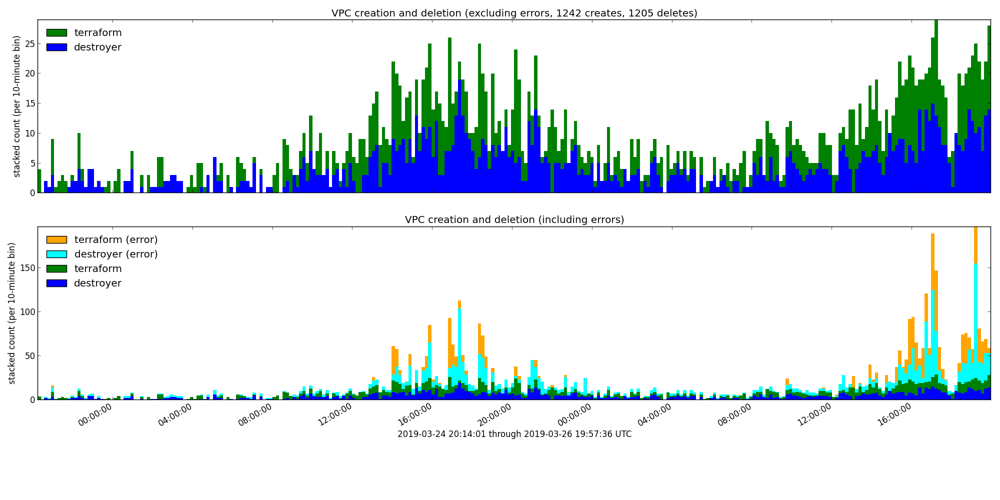

Plot VPC throughput over time.
This can be useful for understanding the load on the account when diagnosing AWS-API throttling errors.
Crunch the CSV output from:

```sql
SELECT eventtime,
       eventname,
       useridentity.username,
       useragent,
       errorcode,
       errormessage
FROM "default"."cloudtrail_logs_cloud_trail_test_clayton"
WHERE from_iso8601_timestamp(eventtime) > date_add('hour', -48, now())
  AND eventname IN ('CreateVpc', 'DeleteVpc')
ORDER BY eventtime;
```

with:


```console
$ vpc.py <vpc.csv
7     Client.VpcLimitExceeded
1112  Client.DependencyViolation
1791  Client.RequestLimitExceeded
```

to generate plots like:


