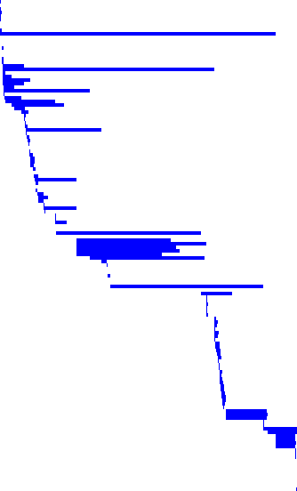
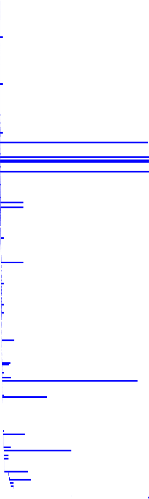

Waterfall scripts to make it easier to find blockers when things are slow.

To plot Terraform creating cluster infrastructure, use:

```console
$ curl -s https://storage.googleapis.com/origin-ci-test/logs/release-openshift-origin-installer-e2e-aws-4.0/6016/artifacts/e2e-aws/installer/.openshift_install.log | terraform-waterfall.py >terraform.svg
```

to generate:



To plot the cluster-version operator pushing manifests from the release image, use:

```console
$ curl -s https://storage.googleapis.com/origin-ci-test/logs/release-openshift-origin-installer-e2e-aws-4.0/6016/artifacts/e2e-aws/pods/openshift-cluster-version_cluster-version-operator-74d8d99566-2bh4q_cluster-version-operator.log.gz | gunzip | cvo-waterfall.py >cvo.svg 
```

to generate:



If you render the SVGs in your browser (vs. GitHub's static `` rendering), you can hover over the bars to get additional information.
